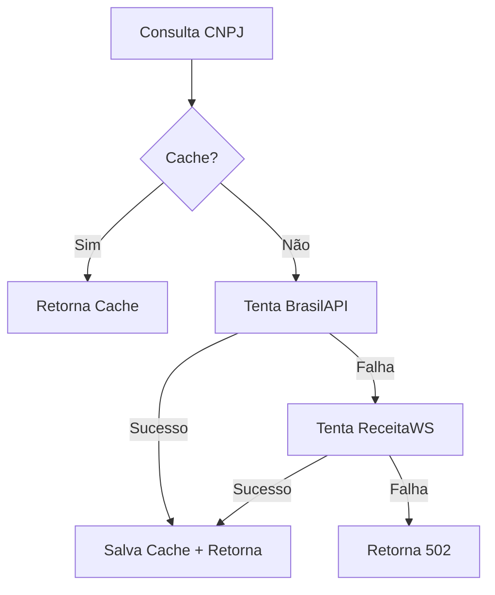

# 📡 APIs Externas - Guia de Solução de Problemas

## ❌ Problema Identificado

As APIs externas (ViaCEP e BrasilAPI/ReceitaWS) estão retornando **403 Forbidden**.

### Causa
O ambiente de desenvolvimento está **bloqueando requisições HTTP externas** devido a:
- Firewall corporativo
- Proxy de rede
- Política de segurança do ambiente
- Restrições de sandbox/container

### Teste de Diagnóstico
```bash
curl -I https://viacep.com.br/ws/01001000/json/
# Se retornar 403, o problema é bloqueio de rede
```

---

## ✅ Soluções

### 1️⃣ **Usar Mocks (Desenvolvimento)**
Para desenvolvimento local quando APIs estão bloqueadas:

1. Edite `routes/api.php` e adicione:
```php
require __DIR__.'/external-mock.php';
```

2. Use os endpoints mockados:
```bash
# CEP mockado
GET /api/external-mock/viacep/01001000

# CNPJ mockado
GET /api/external-mock/receitaws/19131243000197
```

**CEPs disponíveis no mock:**
- `01001000` → Praça da Sé, São Paulo/SP
- `20040020` → Centro, Rio de Janeiro/RJ

**CNPJs disponíveis no mock:**
- `19131243000197` → Empresa Exemplo LTDA

### 2️⃣ **Configurar Proxy** (Se necessário)
Se sua rede usa proxy:

```env
# .env
HTTP_PROXY=http://proxy.empresa.com:8080
HTTPS_PROXY=http://proxy.empresa.com:8080
NO_PROXY=localhost,127.0.0.1
```

### 3️⃣ **Liberar Firewall** (Produção/Staging)
Para ambientes de produção, libere os seguintes domínios:

```bash
# Whitelist necessário
viacep.com.br (porta 443)
brasilapi.com.br (porta 443)
receitaws.com.br (porta 443)
```

**Ubuntu/Debian:**
```bash
sudo ufw allow out 443/tcp
sudo ufw allow out 80/tcp
```

**Docker:**
```yaml
# docker-compose.yml
services:
  app:
    network_mode: "host"
    # ou
    dns:
      - 8.8.8.8
      - 8.8.4.4
```

### 4️⃣ **Testar Conectividade**
```bash
# Teste manual
curl -v https://viacep.com.br/ws/01001000/json/
curl -v https://brasilapi.com.br/api/cnpj/v1/19131243000197

# Deve retornar 200 OK, não 403
```

---

## 📋 Código das APIs (Já Correto)

### ExternalApiController
Localização: `app/Http/Controllers/ExternalApiController.php`

**Endpoints disponíveis:**
- `GET /api/external/viacep/{cep}` - Consulta CEP
- `GET /api/external/receitaws/{cnpj}` - Consulta CNPJ

**Características:**
- ✅ Validação de formato (8 dígitos CEP, 14 dígitos CNPJ)
- ✅ Cache automático (12h CEP, 24h CNPJ)
- ✅ Timeout configurado (5s CEP, 10s CNPJ)
- ✅ Fallback: BrasilAPI → ReceitaWS
- ✅ Tratamento de erros

**Exemplo de uso:**
```javascript
// Frontend
const cep = '01001000';
const response = await fetch(`/api/external/viacep/${cep}`);
const data = await response.json();

// Resultado:
{
  "cep": "01001-000",
  "logradouro": "Praça da Sé",
  "bairro": "Sé",
  "localidade": "São Paulo",
  "uf": "SP"
}
```

---

## 🔄 Fluxo de Fallback (CNPJ)



---

## 🚨 Mensagens de Erro

| Código | Mensagem | Causa |
|--------|----------|-------|
| 422 | CEP inválido | CEP não tem 8 dígitos |
| 422 | CNPJ inválido | CNPJ não tem 14 dígitos |
| 404 | CEP não encontrado | ViaCEP não tem esse CEP |
| 404 | CNPJ não encontrado | Empresa não existe |
| 502 | Erro ao consultar | API externa indisponível |

---

## 📝 Notas Importantes

1. **Não altere o código** do `ExternalApiController.php` - está correto
2. **Use mocks apenas em desenvolvimento** - nunca em produção
3. **Em produção**, certifique-se de que o servidor pode acessar as APIs externas
4. **Cache automático** evita consultas desnecessárias às APIs
5. **Rate limiting** configurado: 100 requisições/minuto

---

## 🆘 Suporte

Se o problema persistir:

1. Verifique logs do Laravel: `storage/logs/laravel.log`
2. Teste conectividade: `curl -v https://viacep.com.br`
3. Verifique configuração de proxy/firewall
4. Em último caso, use os mocks para desenvolvimento

---

**Última atualização:** 2025-01-09
**Status:** APIs externas bloqueadas (403) - use mocks para desenvolvimento
